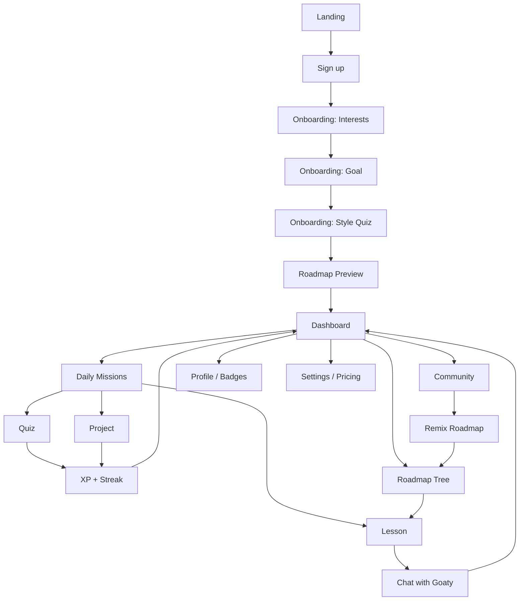

# Goaty — Product Requirements Document

## 1. Product Overview
Goaty is a playful, premium AI learning companion that turns any subject into a personalized adventure taught through the user's own hobbies and interests — sports, anime, gaming, music, cooking, travel, books, or technology. Learners follow bite-sized daily missions, chat with Goaty (an adorable goat mascot with memory), and level up through XP, streaks, badges, and shared community roadmaps.

- Solves: generic, unmotivating learning platforms; low retention; one-size-fits-all curricula.
- Target users: curious teens & adults (13–34), self-learners, hobbyists, career switchers.
- Market value: retention-first, gamified lifelong learning positioned between Duolingo (habits), Notion (organization), Headspace (calm/premium), and Pokémon (collectibles & delight).

## 2. Core Features

### 2.1 User Roles
| Role | Registration Method | Core Permissions |
|------|---------------------|------------------|
| Guest | None | Browse landing, try demo lesson |
| Free Learner | Email + interests onboarding | 1 active roadmap, 3 daily missions, basic chat |
| Premium Learner | Paid subscription | Unlimited roadmaps, unlimited chat memory, exclusive badges & projects, offline lessons |

### 2.2 Feature Module
1. **Landing page**: hero with Goaty mascot, feature tour, testimonials, CTA to onboarding.
2. **Onboarding**: interest selection, learning goal capture, skill level, weekly commitment; generates roadmap preview.
3. **Dashboard**: XP/level ring, streak flame, daily missions, active roadmap, Goaty greeting card, weekly analytics.
4. **Roadmap**: node-based skill tree (Pokémon-style path), lesson/quiz/project nodes, progress %, unlockable branches.
5. **Lesson**: interest-flavored explanation, examples, illustrations, "Ask Goaty" inline chat, next quiz CTA.
6. **Quiz**: multiple choice + free-response, streak bonus, XP payout, incorrect-answer coaching.
7. **Project**: hands-on brief, deliverable checklist, submission gallery, peer reactions.
8. **Chat with Goaty**: full-page chat, memory chips (things Goaty remembers), suggested prompts, typing/blink animations.
9. **Community**: shared roadmaps feed, trending topics, follow creators, remix a roadmap into your own.
10. **Badges & Achievements**: collection wall (Pokédex-style), rarity tiers, unlock reveals.
11. **Notifications**: mission reminders, streak saves, roadmap suggestions, community mentions.
12. **Profile**: avatar (Goaty variants), stats, badge case, roadmap history.
13. **Settings**: interests, goals, notifications, appearance (light/dark), account, subscription.
14. **Pricing / Premium**: free vs. premium comparison, upgrade flow (Stripe mock).

### 2.3 Page Details
| Page Name | Module Name | Feature description |
|-----------|-------------|---------------------|
| Landing | Hero | Animated Goaty mascot placeholder image, headline, CTA "Start free" |
| Landing | Feature tour | Rounded cards for each core feature with soft shadows |
| Landing | Testimonials / Social proof | Rotating quotes, university & creator logos |
| Onboarding | Interest chips | Multi-select from 9 categories with emoji + counts; min 3 |
| Onboarding | Goal capture | "What do you want to learn?" free-text + suggested topics |
| Onboarding | Style quiz | 3 quick questions (pace, depth, playfulness) |
| Onboarding | Roadmap preview | AI-generated roadmap animates in node-by-node |
| Dashboard | Greeting card | Goaty says hi by name, references last activity |
| Dashboard | Daily missions | 3 cards (Lesson / Quiz / Chat challenge) with XP pill |
| Dashboard | XP ring & streak flame | Animated ring, streak counter with fire particles |
| Dashboard | Active roadmap strip | Horizontal mini-map with current node |
| Dashboard | Weekly analytics | Minutes learned, topics mastered, streak history sparkline |
| Roadmap | Skill tree | Vertical winding path of nodes; locked/available/complete states |
| Roadmap | Node detail drawer | Preview lesson, XP reward, prereqs |
| Lesson | Interest lens banner | "Teaching Recursion through Anime" |
| Lesson | Content blocks | Prose, code, image, callout, Goaty tip |
| Lesson | Ask Goaty inline | Floating chat bubble; opens sidebar |
| Quiz | Question card | One question at a time with animated feedback |
| Quiz | Results | XP earned, streak update, next mission |
| Project | Brief | Objectives, materials, steps checklist |
| Project | Submission | Upload/paste + share to community |
| Chat | Chat stream | Bubbles with Goaty avatar, typing dots, reactions |
| Chat | Memory panel | Chips of remembered facts, editable |
| Chat | Suggested prompts | Context-aware quick replies |
| Community | Feed | Roadmap cards with author, remix count, likes |
| Community | Roadmap detail | Read-only view + "Remix" button |
| Badges | Collection wall | Grid of badges with rarity glow, locked silhouettes |
| Notifications | Inbox | Grouped by type, mark-all-read, deep links |
| Profile | Header | Avatar, level, join date, badges preview |
| Profile | Stats | Total XP, minutes, roadmaps completed |
| Settings | Sections | Account, interests, notifications, appearance, subscription |
| Pricing | Plan compare | Free vs. Premium table, monthly/annual toggle |

## 3. Core Process

New learner flow: Landing → Sign up → Onboarding (interests → goal → style) → Roadmap preview → Dashboard. Returning learner flow: Dashboard → Daily mission → Lesson/Quiz/Project → XP payout → back to Dashboard. Chat is accessible from any page via a floating Goaty button.

## 4. User Interface Design

### 4.1 Design Style
- **Primary colors**: Goaty Cream `#FFF8EC`, Sky Mint `#C6F0E2`, Sunset Coral `#FF8A6B`.
- **Secondary / accent**: Deep Ink `#1B1E3B`, Grape `#8B7CFF`, Meadow `#7ED67A`, Sun `#FFCD5B`.
- **Buttons**: pill-shaped, soft 3D with 4px offset shadow that presses in on click (Duolingo-style).
- **Cards**: 20–28px rounded corners, soft dual-layer shadow, subtle inner gradient.
- **Typography**: display font `"Fraunces"` (variable, playful serif); UI font `"Plus Jakarta Sans"`; mono `"JetBrains Mono"`. Sizes: 12/14/16/18/22/28/40/56.
- **Layout**: card-based, generous whitespace, top nav on desktop + bottom tab bar on mobile. Sidebar mini-map on Roadmap.
- **Iconography**: rounded stroke icons (Lucide) + emoji flourishes on interest chips.
- **Motion**: 200–400ms spring transitions, subtle idle bob on mascot, particle bursts on XP payouts, page transitions with fade + 8px lift.
- **Character**: Goaty is displayed as an uploaded PNG mascot in a `` slot with a placeholder image the user can replace.

### 4.2 Page Design Overview
| Page Name | Module Name | UI Elements |
|-----------|-------------|-------------|
| Landing | Hero | Cream background w/ noise, coral CTA button, mascot placeholder image, floating badge stickers |
| Onboarding | Interest chips | Big rounded chip buttons w/ emoji, spring scale on toggle |
| Dashboard | Missions | 3-card grid, gradient border on active, XP pill in coral |
| Roadmap | Skill tree | Winding SVG path, node bubbles with icons, glow on current node |
| Lesson | Content | Reading column max 640px, callout cards with mint tint, Goaty tip with mascot cameo |
| Quiz | Card | Full-bleed card, big buttons, confetti on correct |
| Chat | Bubbles | Goaty bubble cream, user bubble ink-on-white, typing dots animation |
| Community | Feed | Masonry cards with author avatar, remix counter, hover lift |
| Badges | Grid | Hex-tile badges with rarity glow, locked = silhouette |
| Profile | Header | Curved banner, avatar with level ring, badge case strip |
| Settings | Sections | Grouped list, iOS-style toggles, cream section headers |
| Pricing | Plans | Two large cards, Premium has coral halo and floating stars |

### 4.3 Responsiveness
Desktop-first with mobile-adaptive breakpoints at 1200 / 900 / 640. Bottom tab bar appears < 900px. Touch targets ≥ 44px. Reduced-motion respected via `prefers-reduced-motion`.
