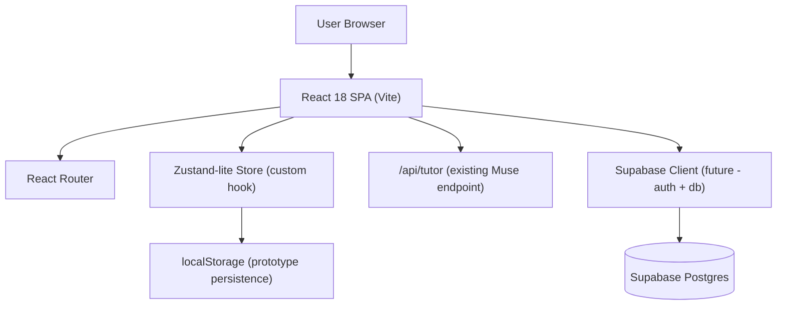
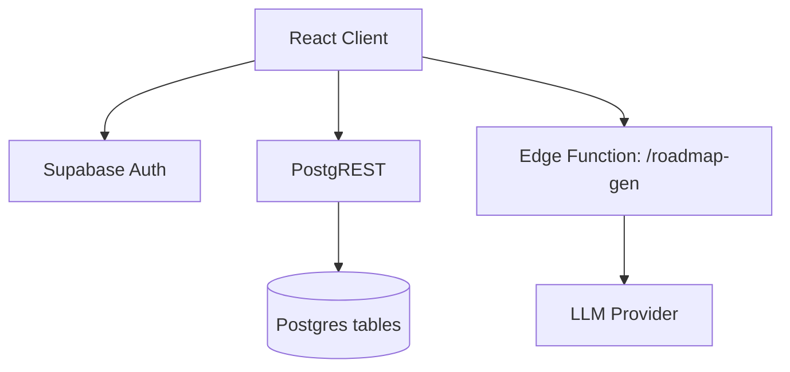
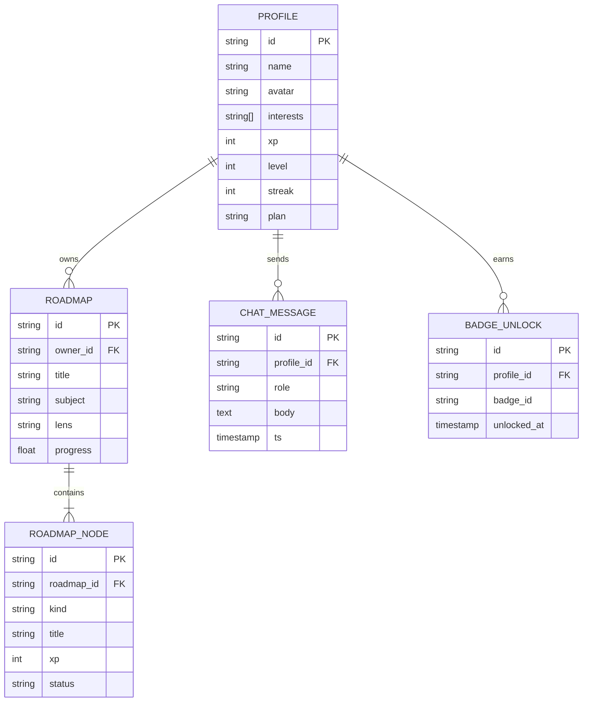

# Goaty — Technical Architecture

## 1. Architecture Design



The Goaty prototype is a client-only React SPA layered on top of the existing Muse Vite project. Muse remains reachable at `/muse`. Goaty routes are additive. Persistence is `localStorage` for v1; Supabase hooks are stubbed so we can swap in real auth/db later without touching UI components ("butterbase" = Supabase per user intent).

## 2. Technology Description
- Frontend: React@18 + React Router@6 + vanilla CSS (design tokens) + Vite@5
- State: single `useGoatyStore` custom hook backed by `localStorage`
- Icons: inline SVG (rounded stroke) — no external icon lib to keep bundle lean
- Animations: CSS transitions + keyframes; `prefers-reduced-motion` respected
- Backend (existing): `/api/tutor` (Anthropic) — reused only by Muse route
- Database (future): Supabase Postgres — not wired in v1

## 3. Route Definitions
| Route | Purpose |
|-------|---------|
| `/` | Goaty landing page with mascot & CTA |
| `/onboarding` | Interests → goal → style → roadmap preview |
| `/app` | Dashboard (default authenticated view) |
| `/app/roadmap` | Skill-tree roadmap |
| `/app/lesson/:id` | Lesson reader with inline Goaty |
| `/app/quiz/:id` | Quiz flow |
| `/app/project/:id` | Project brief |
| `/app/chat` | Full-page chat with Goaty |
| `/app/community` | Shared roadmaps feed |
| `/app/community/:id` | Roadmap detail + remix |
| `/app/badges` | Achievement wall |
| `/app/notifications` | Inbox |
| `/app/profile` | Profile & stats |
| `/app/settings` | Settings |
| `/pricing` | Free vs. Premium |
| `/muse` | Preserved original Muse tutor |

## 4. API Definitions
No new backend endpoints for v1. Types used across the client:

```ts
type Interest =
  | 'sports' | 'tv' | 'anime' | 'gaming'
  | 'music' | 'cooking' | 'travel' | 'books' | 'technology'

interface Profile {
  name: string
  avatar: string           // 'goaty-1' | 'goaty-2' | ...
  interests: Interest[]
  goal: string
  style: { pace: 1|2|3; depth: 1|2|3; playfulness: 1|2|3 }
  xp: number
  level: number
  streak: number
  lastActive: string       // ISO date
  badges: string[]         // badge ids
  plan: 'free' | 'premium'
}

interface Roadmap {
  id: string
  title: string
  subject: string
  lens: Interest            // primary interest used to teach
  nodes: RoadmapNode[]
  progress: number          // 0..1
  author?: string           // for community roadmaps
  remixes?: number
}

interface RoadmapNode {
  id: string
  kind: 'lesson' | 'quiz' | 'project' | 'milestone'
  title: string
  xp: number
  status: 'locked' | 'available' | 'complete'
  prereq?: string[]
}

interface ChatMessage {
  id: string
  role: 'user' | 'goaty'
  text: string
  ts: number
}

interface Mission {
  id: string
  kind: 'lesson' | 'quiz' | 'chat'
  title: string
  xp: number
  done: boolean
}
```

## 5. Server Architecture Diagram
Not applicable in v1 (client-only prototype). Future Supabase layer:



## 6. Data Model

### 6.1 Data Model Definition


### 6.2 Data Definition Language
Deferred to Supabase phase. v1 uses this localStorage key:
```
goaty:v1 → { profile, roadmaps[], chat[], missions[], notifications[] }
```
